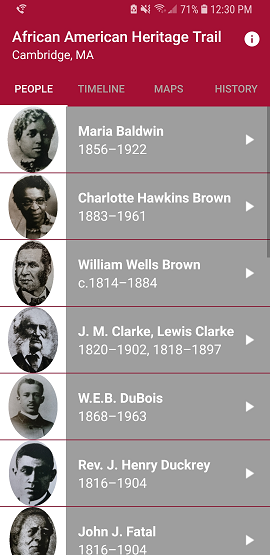
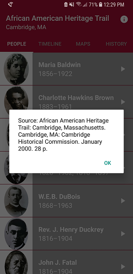

# CambridgeTrails

## Synopsis

Name: Cambridge Trails or African American Heritage Trail:  Cambridge, MA

This is an Android travel application.

The purpose of the application is to teach the user about the history of African Americans in Cambridge, MA.  

The user can click on the People and History fragments to view images and listen to audo clips by clicking on the play button.

The Map fragment allows the user to click on addresses and go to the place where a person lived.  The History fragment uses a Dialog fragment.
An image of a page about a person pops up onto the screen when the play button is clicked.

 <kbd></kbd><kbd></kbd>

## Code Description

The key features in the application are:
ActivityMain, Fragments:  People, Timeline, Maps, History, Dialog

Structure of the code derives from the Miwok application used in class:
https://github.com/udacity/ud839_Miwok

Source of content with permission from the Cambridge Historical Commission:
African American Heritage Trail: Cambridge, Massachusetts. Cambridge, MA: Cambridge Historical Commission. January 2000. 28 p. 

## Motivation

This is the fifth exercise in the "Grow with Google - Android Basic Development Nanodegree Scholarship 2018" program with Udacity.

The purpose of the exercise is to create "travel app."

## Installation

Project can be downloaded from GitHub:  https://github.com/hillc255/CambridgeTrails

## API Reference

## Tests (Future consideration!)

Describe and show how to run the tests with code examples.

## Contributors

Claudia Hill designed and developed this project.

## License

Only to be used for educational purposes.

